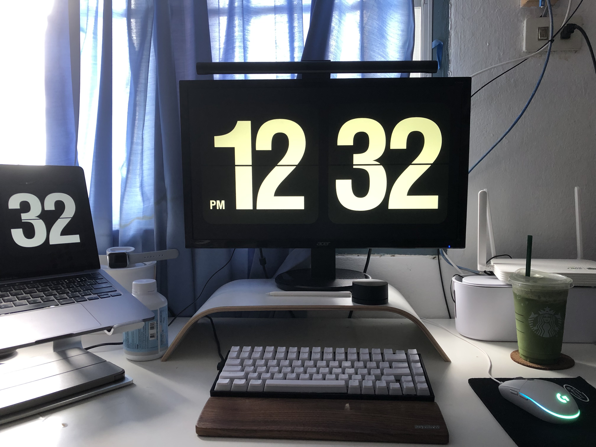
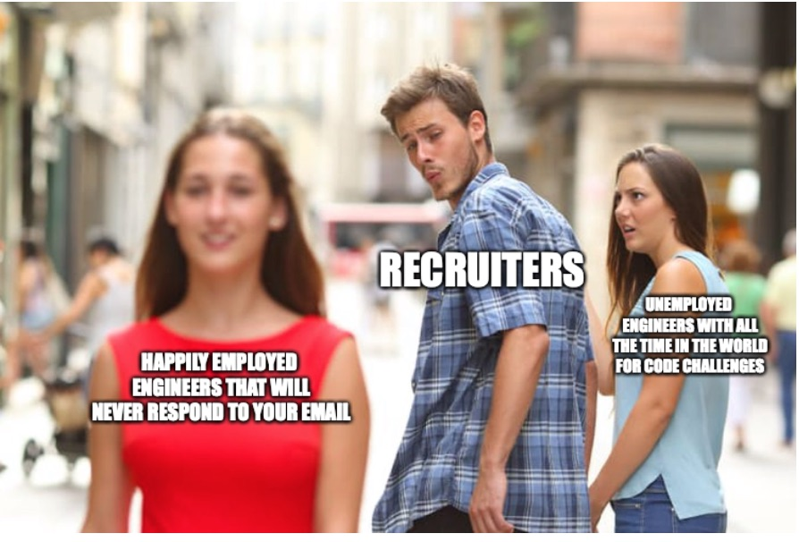

 
 

Hi! I'm currently a full-stack developer working in Thailand for around 1.5 years. I went through a 2-3 months search for a developer/software engineer role a few months before I completed my bachelor's degree. The process was quite frustrating and lengthy, but one of the reasons was that I wanted to ensure my priorities aligned with the job. **Hence, I want to write this blog to help anyone looking to land an entry-level developer role in Thailand and to provide my perspective regarding some misconceptions people might have during  job hunting/searching.** Moreover, another purpose is for me to document/reflect on the 3-months process. 

 

 

 

 

 Keep in mind that this blog is solely based on my personal experience. **You might have a different  experience compared to mine**. Still, I will try my best to highlight common insights / discernible patterns from my journey, so it's as beneficial as possible for people looking for a dev job.

 

**Overview**

 

In total, I applied for 250-270 opportunities. My plan  back then was to ***"apply to all the dev roles available for the new grad."*** I  didn't really  mind whether I would be working on the frontend or backend because I sort of wanted to experience a bit of everything before specializing in anything.

 

**Here's the exact stats.**
 

 

* ***\- Applied: 250+***
* *\- Received info for the application process: 12*
* *\- Ignored the email cuz I didn't rly wanna work there: 6*
* *\- went through application process( interviews/ tests): 6*
* *\- Rejected: 2*
* ***\- Received a final offer: 4*** 

 

**The final 4s were** 

 

1. *1. IBM*
2. *2. Accenture*
3. *3. Thoughtworks*
4. *4 .some e-commerce startup (don't rmb the name)*

 

 

**Crappy Recruiters**

 

As you can see from the stats, I got replies back/received info for the  application process < 5% of all the applications I applied. Surprisingly, It is pretty typical as most people I know also don't usually get a reply/email back from most of the jobs they applied for.

 

From discussing w/ recruiters regarding the issues, it is  typical  that  candidates will be screened before moving on to the next step. **However, the crappy part is not all candidates are being screened/ reviewed fairly.** More often than not, they might even move on to other candidates and hang you out to dry without informing you. In my opinion, it's a bit ridiculous to deny people a shot for the jobs just because recruiters don't do their jobs properly.
 

 

Therefore, **please** **don't read into it too much when you don't get a reply back. You might be a stellar candidate for the position, but the recruiters, for whatever reasons, choose other candidates over you.** 

 
 

 

**Referral**

 

As I mentioned earlier with the recruiter issue, one of the workarounds is getting a referral from people you know inside the company. Most companies provide referral fees to employees who successfully refer a new hire, so they are also incentivized to refer you to their recruiters.  I actually got a referral from my senior for an interview at Agoda. That helped me get an interview, but sadly I didn't pass the test 🥲. Still, asking for a referral from people you know is probably the best way to bypass/ deal with the issue of not getting an interview in the first place.

> \
> \
> **An insight I gained *was "the best possible outcome from a referral is only landing you  interviews. You still need to do ur part to pass them."***

 

 
 

**Hard /technical skill > soft skill**

 

 

As someone who spends a great deal of my time during college on extracurricular / activities that don't necessarily relate to coding/tech (Hackathon, startup, non-profit, biz case, student activities blabla), I do think I have a somewhat unique background. Sadly, the primary/ 1st priority criteria for assessing developers during interviews is a technical skill (coding). Being a great communicator/facilitator + other stuff does matter to some degree, and it might be more crucial as u become more senior, but the main expectation for junior dev is mostly to deliver what you are expected to do, e.g., implement features w/ quality codes, resolve bugs/defects etc. I have no regrets about how I spent my time during college, as I do feel like I have a unique strength which many interviewers also recognized, but **definitely do prioritize technical skills> soft skills for junior dev when you prepare for the interviews as It will help u land a job much easier, especially for entry-level.** Highly recommend you to grind [leetcode](https://leetcode.com)( focus on easy & medium questions).

 

 

 

**Application process (interviews + all kinds of tests)**

 

## **The Purposes**

 

From the interviewers/ hiring people's perspective, their approach toward you is  **" evaluating whether you as a candidate are a good fit for the role or not,"** which makes sense from their side, but I would also encourage you to leverage the interviews as ways to

 

1. **1.** Address your concerns/ questions regarding the role as well as the company. here are topics I brought up in my interviews

   * \-Org's culture
   * \-Commute
   * \-Compensation & Benefit
   * \-Engineering practice
   * \-Work hours/ work-life balance
   * \-any factors that might affect your decision regarding the job.
2. **2.** Assess whether the opportunities actually align with your priorities for the job.
3. **3.** Take advantage of the interviews to just learn/ gain more knowledge both in terms of technical skills  ,industry knowledge and how to crack the interviews

 

At the end of the day, you are going to choose  only one job anyway, so ***it's best (imo) to make sure you land the opportunity you desire the most by maximizing the info regarding the position as well as gaining something from the interviews besides the result of the interviews.*** From my experience, I learned a ton during my application processes from most companies I applied e.g. industry knowledge, coding skill, architectural decisions based on the company's context, criteria companies used to assess candidates etc, so I do believe all the interviews/ tests were worth the time for me even though I went through a ton of them. Furthermore, interviews generally also do like candidates who seem proactive & vocal as it can indicate the interest in the role as well as an ability to communicate effectively.

 

## **Types of interviews/tests & insights**

 

From my experiences, there are usually 2-5 rounds of interviews/tests for the whole application process (based on the companies).

 

1. **1. Recruiter call/chat** where the person will ask you  a few questions to make sure that your background and CV are legit.
2. **2. Technical rounds.** I can categorize mainly 2 ways of the technical interview I have faced so far.

   * **\-The coding interview revolves around data structure and Algorithm**s. They will give you a coding problem similar to the ones from leetcode. Most of the time, the interviewers will ask you to articulate your thoughts as you are solving the problem as well. For this one, the preparation is pretty much picking a language you prefer and grinding leetcode as much as possible. Focus on easy and medium questions & a few data structures - Array, String, Hash Tables. Make sure you can provide the time complexity as well as the space complexity of your solution.  **I mostly faced this type of technical interview.**
   * \-Another way of technical interviews is where **they provide a problem that's more relevant to the position you applied** for. For instance, I applied for a front-end role, and they gave me a problem to test my HTML/ CSS/ JS knowledge as well as generic JS syntax  & how to do layouts/ stylings/ logic problems.
3. **3. Culture fit** - usually just to make sure that you will fit in / align with the company's culture. (Most companies I applied skipped this one, but I included it anyway lol)       

 

 For large-sized & international enterprises, they sometimes add an extra round to test other aspects of the candidates, e.g., cognitive tests, problem-solving tests. Still, **most of my interviews followed a similar pattern above here.**

 

 

**Negotiating the offers.**

 

A piece of advice I got early on for negotiating the offers was

 

>  ***Lining up interviews from different companies in the same timeframe so you can use the offers from multiple companies(in case you got accepted for the position) to negotiate with the companies back and forth to maximize your compensation & benefits.***

 

 Even though I was fortunate enough to land a few offers, being a new graduate ( no full-time working experience + 2 internships) unsurprisingly did not give me any negotiating power with the big-tech companies in Thailand even with the competing offers. However, I do still believe in the advice as I have heard it so many times from people in the industry worldwide. I will try out the idea again when I'm looking for a new job lol. **The industry insight I learned from this step was that developers are so high in demand to the point where the salary ceiling even for new grads can also be hyperinflated.**

 

**Check out my LinkedIn page from the footer down below to find out where I ended up accepting the offer 😎**

 

 

**Conclusion**

 

To sum up, I have touched on my job-searching journey from start to finish. Not sure how helpful it will be as tech industry's application processes are not as standardized compared to other industries( based on my google search lol). When I was looking for a dev job, I read countless job-searching blogs/articles for a dev role  to understand what the job application process was like, and I learned a lot from them, even though I also did a few internships beforehand. Sharing my experience here is my way of contributing back to the community. This is my first time blogging, and it's been fun. Sorry if it's not to your liking, and thanks for reading!